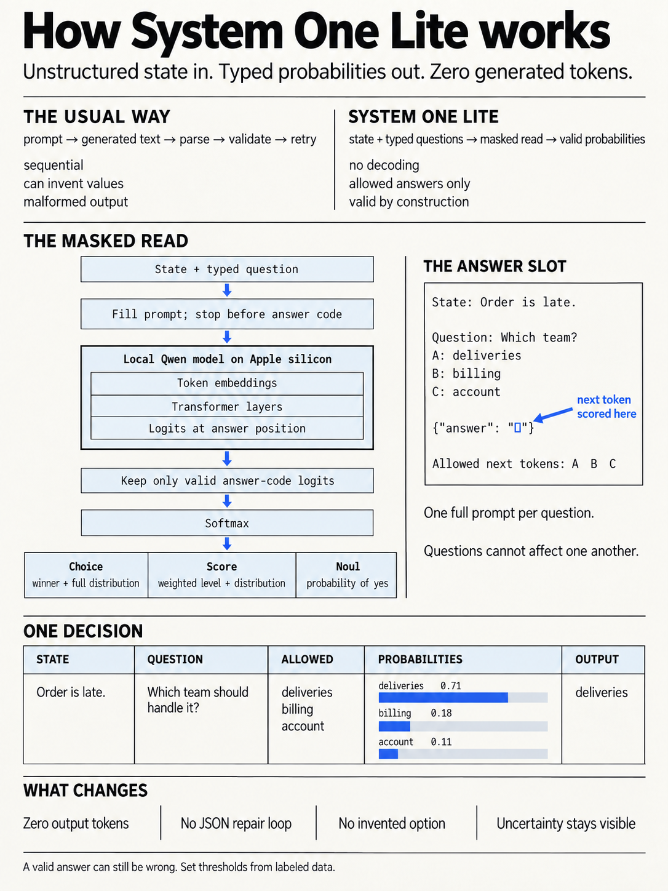

# System One Lite

System One Lite is a proof-of-concept HTTP service for constrained decisions
with a local language model. Send text or JSON plus one or more typed questions.
The service returns probabilities over the answers you declared.

It does not generate a text response or parse model-written JSON. It reads the
model's scores at a fixed answer position and returns a validated response.



## What is it for?

System One Lite is intended for narrow tasks whose possible answers are known
in advance, such as:

- routing a support request to a team;
- scoring urgency on an ordered scale;
- deciding whether a record needs human review; or
- combining several model judgments in application code.

It is not a general chat API, a text generator, or a multi-step reasoning
system. It is an independent experiment built with stock open-weight models
and MLX.

## What can it return?

Each question uses one of three types:

| Type | Use | Result |
| --- | --- | --- |
| [Choice](docs/primitives/choice.md) | Select one item from a closed set | Winning key, probability for every option, and confidence |
| [Score](docs/primitives/score.md) | Place the state on an ordered scale | Probability-weighted score, probability for every level, and confidence |
| [Noul](docs/primitives/noul.md) | Judge a yes-or-no statement | Probability of yes |

`Noul` is the project's name for a boolean judgment with uncertainty. A value
of `0.9` means the model assigned 90% of the allowed probability mass to
`yes`. It does not mean the answer has been calibrated to be correct 90% of
the time.

## How does it work?

For each question, the server:

1. Formats the state, instructions, and allowed answers as a prompt.
2. Maps the allowed answers to token codes such as `A`, `B`, and `C`.
3. Runs the model to the fixed answer position without decoding text.
4. Keeps only the logits for valid answer codes and applies softmax.
5. Maps those probabilities back to the answer names supplied by the caller.

Questions are evaluated independently. Each question gets its own prompt and
another copy of the state. This prevents one answer from affecting another,
but runtime and input-token use grow with the number and length of questions.

See [How it works](docs/how-it-works.md) for the prompt format, answer-code
registry, token limits, and confidence calculation.

## Requirements

- An Apple silicon Mac. The server uses MLX.
- Python 3.12 or newer.
- [`uv`](https://docs.astral.sh/uv/).
- Network access on the first run to download the selected model if it is not
  already cached.

The Python SDK requires Python 3.9 or newer. The JavaScript SDK requires Node
22.18 or newer.

## Start the server

From the repository root:

```bash
cd server
uv sync
uv run uvicorn system_one_lite.api:app --port 8010
```

The default profile uses `mlx-community/Qwen3-1.7B-4bit`. On first startup, the
server downloads the pinned model revision and compiles the Metal kernels.

Send a request to `POST /evaluate`:

```bash
curl -s http://127.0.0.1:8010/evaluate \
  -H "Content-Type: application/json" \
  -d @- <<'EOF'
{
  "state": {
    "message": "My order was due Friday, but it is still in transit."
  },
  "questions": {
    "team": {
      "type": "choice",
      "instructions": "Which team should handle this message?",
      "criteria": {
        "deliveries": "Late, missing, or damaged orders",
        "billing": "Charges, refunds, or payment methods",
        "account": "Login, profile, or app problems"
      }
    },
    "urgency": {
      "type": "score",
      "instructions": "How urgent is this request?",
      "criteria": [
        "Can wait",
        "Needs attention this week",
        "Needs attention today"
      ]
    },
    "needs_reply": {
      "type": "noul",
      "instructions": "Does the customer need a reply?"
    }
  }
}
EOF
```

The response has one typed answer under each question ID:

```json
{
  "model": "mlx-community/Qwen3-1.7B-4bit",
  "answers": {
    "team": {
      "type": "choice",
      "choice": "deliveries",
      "probabilities": {
        "deliveries": 0.71,
        "billing": 0.18,
        "account": 0.11
      },
      "confidence": 0.565
    },
    "urgency": {
      "type": "score",
      "score": 1.2,
      "legend": {
        "0": "Can wait",
        "1": "Needs attention this week",
        "2": "Needs attention today"
      },
      "probabilities": {
        "0": 0.1,
        "1": 0.6,
        "2": 0.3
      },
      "confidence": 0.4
    },
    "needs_reply": {
      "type": "noul",
      "noul": 0.88
    }
  },
  "usage": {
    "input_tokens": 220,
    "output_tokens": 0
  }
}
```

These values illustrate the response shape. Exact values depend on the model
and input. `POST /v1/systemone` is an alias for the same endpoint. The
[API reference](docs/api.md) lists every field, limit, and error response.

## Python example

The local [Python SDK](sdks/python/README.md) provides synchronous and
asynchronous clients with no runtime dependencies. This example can run from
`sdks/python/` while the server is running:

```python
from system_sdk import Choice, Noul, SystemClient

with SystemClient() as client:
    response = client.system_one(
        state={
            "order": "DB-4471",
            "status": "in transit",
            "due": "Friday",
        },
        questions={
            "team": Choice(
                instructions="Which team should handle this order?",
                criteria={
                    "deliveries": "Late, missing, or damaged orders",
                    "billing": "Charges, refunds, or payment methods",
                    "account": "Login, profile, or app problems",
                },
            ),
            "needs_reply": Noul(
                instructions="Does the customer need a reply?",
            ),
        },
    )

team = response.choices["team"]
needs_reply = response.nouls["needs_reply"].noul

if team.confidence < 0.4:
    queue = "manual-review"
elif needs_reply >= 0.8:
    queue = team.choice
else:
    queue = "no-reply"

print(queue, team.probabilities)
```

The thresholds are examples. Set them from labeled data that represents the
traffic the application will receive.

## TypeScript example

Install the local [JavaScript SDK](sdks/javascript/README.md), then call the
same server:

```bash
npm install /path/to/system-one/sdks/javascript
```

```ts
import { choice, noul, SystemClient } from "system-sdk";

const client = new SystemClient();
const response = await client.systemOne({
  state: {
    order: "DB-4471",
    status: "in transit",
    due: "Friday",
  },
  questions: {
    team: choice("Which team should handle this order?", {
      deliveries: "Late, missing, or damaged orders",
      billing: "Charges, refunds, or payment methods",
      account: "Login, profile, or app problems",
    }),
    needsReply: noul("Does the customer need a reply?"),
  },
});

const team = response.answers.team;
const queue =
  team.confidence < 0.4
    ? "manual-review"
    : response.answers.needsReply.noul >= 0.8
      ? team.choice
      : "no-reply";

console.log(queue, team.probabilities);
```

Both SDKs use `http://127.0.0.1:8010` by default. Set `SYSTEM_BASE_URL` or
pass a base URL to the client to use another address.

## Model profiles

| Profile | Model |
| --- | --- |
| `default` | `mlx-community/Qwen3-1.7B-4bit` |
| `larger` | `mlx-community/Qwen3-4B-Instruct-2507-4bit` |

Download either pinned model revision explicitly:

```bash
cd server
uv run python -m tools.download_model default
uv run python -m tools.download_model larger
```

Select a profile before starting the server:

```bash
SYSTEM_ONE_MODEL=larger uv run uvicorn system_one_lite.api:app --port 8010
```

The demo, benchmark, and evaluation tools also accept `--model default` or
`--model larger`. Each supported model has a checked-in registry of answer
codes that must remain single tokens with the pinned tokenizer.

## Evaluation

The evaluation tool reads JSONL files in the envelope documented in
[`datasets/README.md`](datasets/README.md). It reports accuracy by question
type and checks whether rotating Choice options changes the result.

```bash
cd server
uv run python -m tools.evals --datasets /path/to/jsonl-directory --limit 20
```

Use labeled data from the intended application before setting routing or
review thresholds. Synthetic examples are useful for testing the interface,
but they do not establish production accuracy.

## Limits

System One Lite is an experiment, not a production decision service.

- The included 1.7B and 4B models can return the wrong allowed answer.
- Probabilities are model scores, not calibrated odds of correctness.
- Choice and Score confidence measures how concentrated the returned
  distribution is. It does not measure factual accuracy.
- Each question repeats the state and runs as a separate model pass.
- The server handles one inference request at a time and returns `503` when
  the engine is busy.
- A request can contain at most 64 questions. Choice supports at most 578
  options, and Score supports 2 to 10 levels.
- The current server requires Apple silicon.

Read [Confidence](docs/confidence.md) before using a score for an expensive,
sensitive, or hard-to-undo action.

## Run the checks

```bash
cd server
uv run ruff check src tools tests
uv run ruff format --check src tools tests
uv run pytest

cd ../sdks/python
uv run --with pytest pytest -q

cd ../javascript
npm ci
npm run typecheck
npm test
```

## Project map

| Path | Contents |
| --- | --- |
| [`server/`](server/) | FastAPI service, MLX engine, evaluation tools, and tests |
| [`sdks/python/`](sdks/python/) | Python client |
| [`sdks/javascript/`](sdks/javascript/) | TypeScript client |
| [`docs/`](docs/) | Guides and API reference |
| [`datasets/`](datasets/) | Dataset format and local evaluation data |

Start with the [quickstart](docs/quickstart.md) for a shorter walkthrough or
the [API reference](docs/api.md) for the complete contract.

## License

[MIT](LICENSE). The supported MLX model repositories use Apache 2.0.
